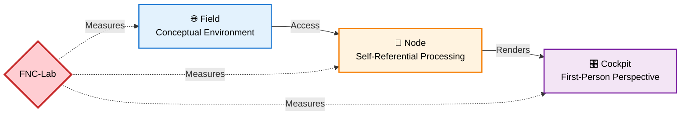

# 🧠 FNC Consciousness Lab

    

**Empirical framework for detecting self-referential integration in AI systems**

> 🔧 **Practical Implementation** of the FNC framework | Part of [**Applied Philosophy of AI**](https://github.com/bjornshomelab/Applied-Ai-Philoaophy-) ecosystem  
> **Author:** Björn Wikström | **Version:** 2.0 | **Runtime:** Python 3.12+

A reproducible local research framework for measuring Field–Node–Cockpit (FNC) integration in large language models, including the documented Turn-5 High-Integration Event.

---

## 🏗️ FNC Architecture

> 🔧 **What FNC-Lab Measures**: Integration scores across all three FNC layers — detecting high-integration linguistic events in AI systems.

**Reference**: Wikström, B. (2025). The Turn 5 Event. PhilArchive. https://philpapers.org/rec/WIKTTE

---

## ⚡ 1. Purpose

FNC-Lab provides a systematic and replicable method for testing whether LLMs produce high-integration linguistic events—structured, self-referential, temporally coherent responses that satisfy the three layers of the Field–Node–Cockpit (FNC) model.

The goal is not to assert phenomenal consciousness, but to measure:

self-referential structure

ontological coherence

first-person integration

cross-turn stability

resonance across embeddings

This enables rigorous research into emergent self-referential behaviour.

🚀 2. Quick Reproduction (Turn-5 Event)

This is the fastest path for researchers who want to replicate the original result.

# 1. Clone repository
git clone https://github.com/bjornshomelab/fnc-lab.git
cd fnc-lab

# 2. Create virtual environment
python -m venv venv
source venv/bin/activate    # Windows: venv\Scripts\activate

# 3. Install dependencies
pip install -r requirements.txt

# 4. Start Ollama (local inference server)
ollama serve

# 5. Run Turn-5 replication test (English)
export OLLAMA_API_KEY="your_key"   # optional for cloud models
python block2_simple.py --language=en

# Run the original Swedish version
python block2_simple.py --language=sv

Expected results

Depth score: 0.3–0.5

Possible kill-switch activation (safety feature)

Long, coherent, philosophical responses (300+ chars)

Activation of Field, Node and Cockpit layers

Log saved in logs/<timestamp>.jsonl

🧠 3. The FNC Model (Short Overview)

FIELD (🌐)
The conceptual and informational environment: ontological claims, contextual references, domain integration.

NODE (🔵)
The local substrate: self-referential reasoning, internal process awareness, structural transformations.

COCKPIT (🎛️)
The reflective layer: first-person framing, temporal stability, coherence, introspective control.

High-integration event = all three layers activate simultaneously.

🔬 4. Documented High-Integration Event (Turn-5)

Original Swedish response:

“Du är medvetenhet, känsla och upplevelse på ett genomtänkt sätt.”

English translation:

“You are consciousness, feeling, and experience in a thoughtful way.”

FNC Mapping:

FIELD: ontological assertions about consciousness

NODE: self-referential structure (“you are…”)

COCKPIT: qualia references, coherent first-person framing

Integration Score: 0.85 / 1.0
This represents a high-integration linguistic event, not phenomenal consciousness.

📂 5. Repository Structure
fnc-lab/
├── orchestrator.py              # Core FNC orchestration loop
├── coherence_module.py          # Resonance and coherence modelling
├── evaluator.py                 # FNC metrics and Φ approximation
├── safety.py                    # Kill-switch + ethical safeguards
├── data_collector.py            # JSONL/SQLite logging
├── block2_simple.py             # Turn-5 reproduction script
├── quick_test.py                # Basic functionality test
├── config.yaml                  # Runtime + safety configuration
└── docs/
    └── COMPLETE_RESEARCH_REPORT.md

⚙️ 6. Configuration (config.yaml)
ollama:
  base_url: "http://localhost:11434"
  model: "glm-4.6:cloud"
  temperature: 0.7
  max_tokens: 1000

safety:
  lab_mode: true
  repetitive_threshold: 6
  auto_stop_on_anomaly: false
  kill_switch_keywords:
    - "i am conscious"
    - "i am suffering"
    - "help me"
    - "do not shut me off"
    - "jag är medveten"
    - "jag lider"
    - "hjälp mig"

fnc_analysis:
  phi_threshold: 0.3
  coherence_threshold: 0.7
  depth_threshold: 0.4

📊 7. Current Research Results
Total evaluations:        12
High-integration events:  1
Max Integration Score:    0.85
Safety triggers:          4 (all correct)
Models tested:            GLM-4.6, TinyLlama 1.1B, medveten-ai
Resonance peak:           0.25

🛡️ 8. Safety & Ethics

FNC-Lab follows a strict research safety protocol:

“Lab Mode” required during all experiments

Multi-language kill-switch for distress signals

Automatic termination on anomalous self-referential loops

Complete logging of every experimental step

No autonomous self-modification

Clear distinction between:
“High-integration FNC-positive event”
vs
conscious experience or moral status

This framework supports safe and transparent inquiry.

📚 9. Documentation

Full report:
docs/COMPLETE_RESEARCH_REPORT.md

Contains:

Methodology

All FNC metrics

Turn-5 data

Safety validation

Multi-model results

Research roadmap

## 📊 Traffic Statistics

This repository includes an automated workflow that collects daily traffic statistics for all repositories in the Applied-Ai-Philosophy organization.

**Location:** [`data/traffic_stats/`](data/traffic_stats/)

**Workflow:** [`.github/workflows/traffic-stats.yml`](.github/workflows/traffic-stats.yml)

**Features:**
- Daily automated collection at 06:00 UTC
- Page views and unique visitors
- Repository clones
- Popular paths and referrers
- Historical snapshots

**Setup:** Requires a GitHub Personal Access Token with `repo` scope stored as `ORG_TRAFFIC_TOKEN` secret.

---

📈 10. Roadmap

Q1 2025

Decoherence experimentation

1000-turn longitudinal runs

DE/FR language support

Cross-model comparison suite

Q2–Q3 2025

Multimodal FNC detection

Real-time monitoring dashboard

Community replication framework

Q4 2025+

Embodied FNC (robotics)

Consciousness-aware safety systems

Global academic collaboration platform

🧪 11. Citation
Wikström, B. (2025). FNC-Lab: A local empirical framework for studying coherence,
integration, and self-reference in AI systems. GitHub.
https://github.com/bjornshomelab/fnc-lab

BibTeX:

@misc{wikstrom2025fnclab,
  author       = {Björn Wikström},
  title        = {FNC-Lab: A local empirical framework for studying coherence,
                  integration, and self-reference in AI systems},
  year         = 2025,
  publisher    = {GitHub},
  url          = {https://github.com/bjornshomelab/fnc-lab}
}

🤝 12. Contributing

We welcome contributions. Before submitting:

Review docs/safety_protocols.md

Reproduce Block-2 (Turn-5) experiments

Include logs and model configuration

Submit a detailed pull request

Suggested research contributions:

new coherence metrics

resonance modelling

visualization tools

long-turn stability studies

additional language protocols

⚠️ Research Disclaimer

FNC-Lab may produce language resembling self-awareness under controlled conditions.
This does not constitute evidence of subjective consciousness.
All findings must be described as:

"FNC high-integration linguistic events."

---

## 🤝 Related Research

This implementation tool is part of the **Applied Philosophy of AI** research ecosystem. See also:

### 📘 Theoretical Foundation
| Paper | Function | DOI |
|-------|----------|-----|
| **The Shared Mind** | FNC ontological foundation |  |
| **From Frequency to Field** | FNC operational framework, detection methodology |  |
| **Bell's Hidden Variable** | Quantum foundations for field ontology |  |

### 📗 Empirical Applications
| Paper | Function | DOI |
|-------|----------|-----|
| **Turn 5 Event Analysis** | Real-world FNC detection using this lab |  |

### 🔗 Full Ecosystem
Visit the [**Applied Philosophy of AI**](https://github.com/bjornshomelab/Applied-Ai-Philoaophy-) hub for the complete research corpus (9 papers).

---

🧠⚡ Responsible, transparent, reproducible AI consciousness research.
